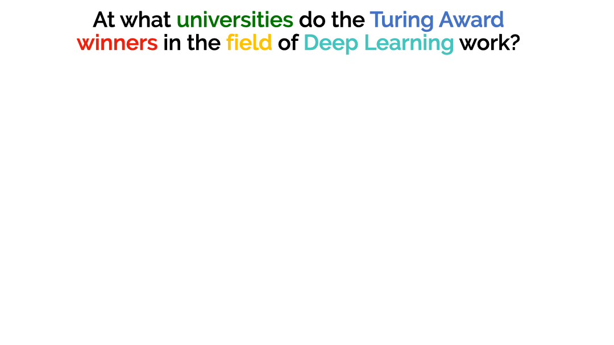
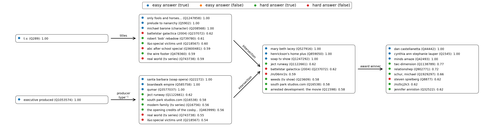

# GNN-QE: Graph Neural Network Query Executor #



This is the official code base of the paper

[Neural-Symbolic Models for Logical Queries on Knowledge Graphs][paper]

[Zhaocheng Zhu](https://kiddozhu.github.io),
[Mikhail Galkin](https://migalkin.github.io),
[Zuobai Zhang](https://oxer11.github.io),
[Jian Tang](https://jian-tang.com)

[paper]: https://proceedings.mlr.press/v162/zhu22c/zhu22c.pdf

## Overview ##

GNN-QE is a neural-symbolic model for answering multi-hop logical queries on
knowledge graphs. Given a multi-hop logical query, GNN-QE first decomposes it into
4 basic operations over fuzzy sets, and then executes the operations with graph
neural networks and fuzzy logic operations.

Additionally, the intermediate variables in GNN-QE are interpretable, and one can
visualize them to better understand the multi-hop reasoning process.



## Installation ##

The dependencies can be installed via either conda or pip. GNN-QE is compatible
with Python 3.7/3.8/3.9 and PyTorch >= 1.8.0.

### From Conda ###

```bash
conda install torchdrug pytorch cudatoolkit -c milagraph -c pytorch -c pyg
conda install easydict pyyaml -c conda-forge
```

### From Pip ###

```bash
pip install torchdrug torch
pip install easydict pyyaml
```

## Usage ##

To run GNN-QE, use the following command. Alternatively, you may specify
`--gpus null` to run GNN-QE on a CPU. All the datasets will be automatically
downloaded in the code.

```bash
python script/run.py -c config/fb15k237.yaml --gpus [0]
```

We provide the hyperparameters for each experiment in a separate configuration file.
The hyperparameters are designed for 32GB GPUs, but you may adjust the batch size
to fit a smaller GPU memory. All the configuration files can be found in
`config/*.yaml`. 

To run GNN-QE with multiple GPUs or multiple machines, use the following commands

```bash
python -m torch.distributed.launch --nproc_per_node=4 script/run.py -c config/inductive/wn18rr.yaml --gpus [0,1,2,3]
```

```bash
python -m torch.distributed.launch --nnodes=4 --nproc_per_node=4 script/run.py -c config/inductive/wn18rr.yaml --gpus[0,1,2,3,0,1,2,3,0,1,2,3,0,1,2,3]
```

Once you have models trained on FB15k-237, you can visualize the intermediate
variables with the following line. The visualizations will be output in a new
experiment directory as `png` files. Please replace the checkpoint with your own
path.

```bash
python script/visualize.py -c config/fb15k237_visualize.yaml --checkpoint /path/to/gnn-qe/experiment/model_epoch_10.pth
```

## Bring your own GNNs ##

Generally, GNN-QE is a GNN-agnostic framework for answering logical queries.
You may plug any GNN model into GNN-QE. To do so, just implement the convolution
layer in `gnnqe/layer.py` and the GNN model in `gnnqe/gnn.py`. The GNN model is
expected to have the following signature

```python
def forward(self, graph, input, all_loss=None, metric=None):
    ...
    return {
        "node_feature": node_feature,
    }
```

where the arguments and the return value are
- `graph` (data.Graph): the knowledge graph with `graph.query` being the query
  embeddings of shape `(batch_size, input_dim)`. 
- `input` (Tensor): input tensor of shape `(|V|, batch_size, input_dim)` 
- `all_loss` (Tensor): a scalar tensor that accumulates losses during training
- `metric` (Tensor): a dict that stores any scalar information for logging during
  training
- `node_feature` (Tensor): node feature of shape `(|V|, batch_size, output_dim)`

For how to implement GNN models in TorchDrug, please refer to these tutorials
- [Graph Neural Network Layers](https://torchdrug.ai/docs/notes/layer.html)
- [Customize Models & Tasks](https://torchdrug.ai/docs/notes/model.html)

## Frequently Asked Questions ##

1. **The code is stuck at the beginning of epoch 0.**

   This is probably because the JIT cache is broken.
   Try `rm -r ~/.cache/torch_extensions/*` and run the code again.

## Citation ##

If you find this project useful in your research, please cite the following paper

```bibtex
@inproceedings{zhu2022neural,
  title={Neural-Symbolic Models for Logical Queries on Knowledge Graphs},
  author={Zhu, Zhaocheng and Galkin, Mikhail and Zhang, Zuobai and Tang, Jian},
  booktitle={Proceedings of the 39th International Conference on Machine Learning},
  pages={27454--27478},
  volume={162},
  year={2022},
}
```